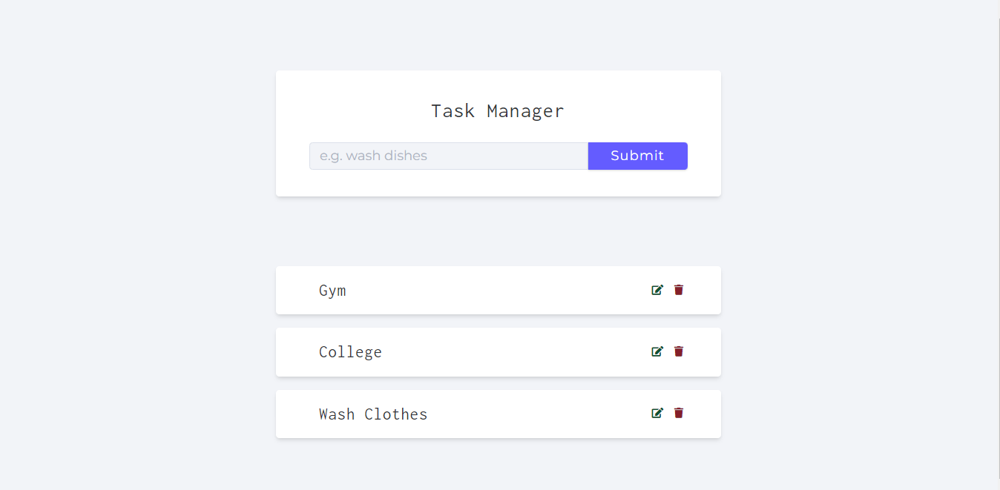
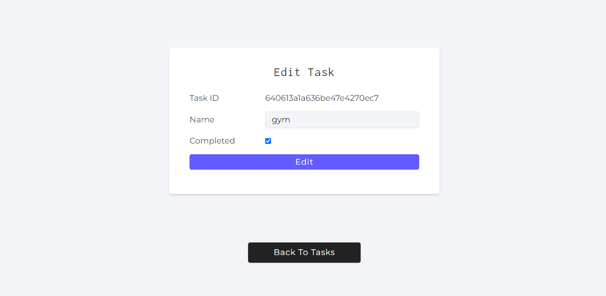
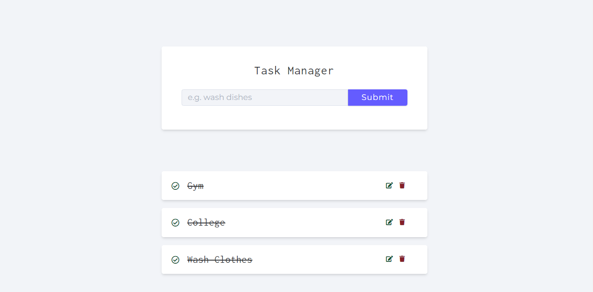

# Task-Manager

A task managing application

## Tech Stack

### Frontend

### Server

## Features

- Stores all the tasks in cloud database
- Performed all the CRUD operations. 

## Sneak Peek of Task Managing App

<!-- <table>
  <tr>
    <td></td>
    <td></td>
    <td></td>
  </tr>
</table> -->

## Contact
If you want to contact me, you can reach me through below handles.

